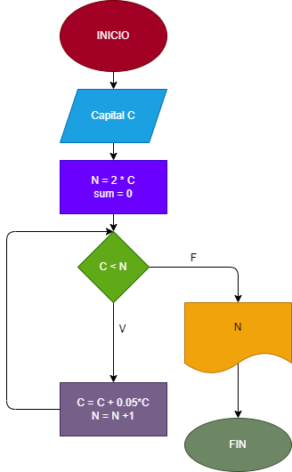

# Interes-Compuesto
Hacer el diagrama y programa en pyhton, que lea una capital c, y que averigüe e imprima en cuántos meses se duplica si lo colocamos a un interés compuesto de 5% mensual. 

# Diagrama de flujo

